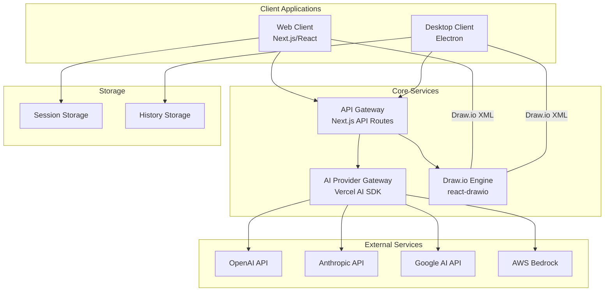
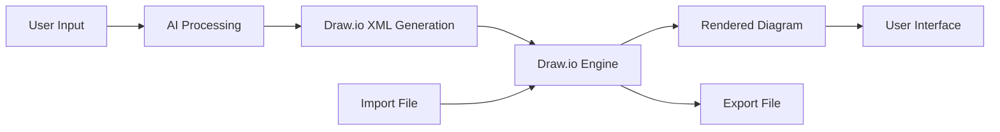
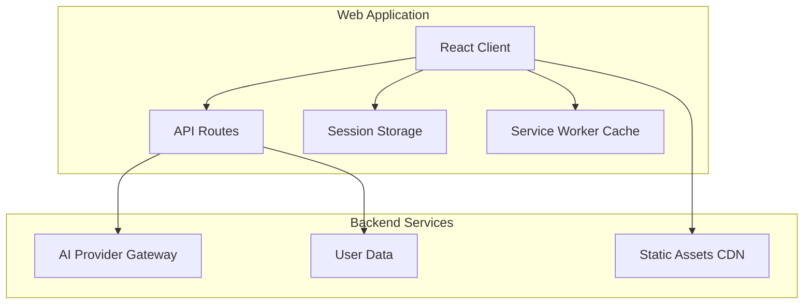
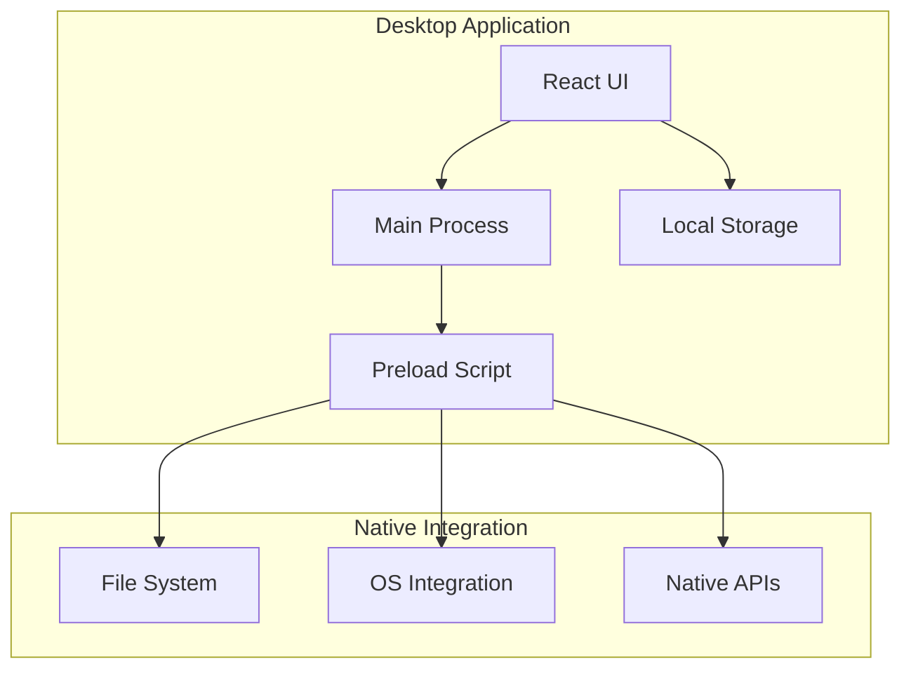
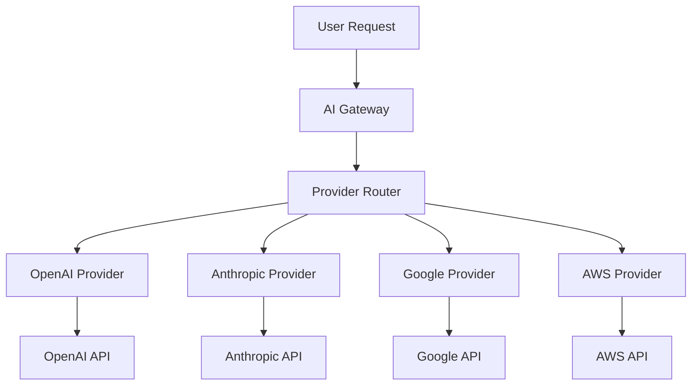

# System Architecture

This document provides a comprehensive overview of the AIO Canvas system architecture, including the draw.io wrapper design, multi-platform deployment, and AI integration patterns.

---

## Table of Contents

- [Overview](#overview)
- [High-Level Architecture](#high-level-architecture)
- [Core Components](#core-components)
- [draw.io Integration Architecture](#drawio-integration-architecture)
- [Multi-Platform Architecture](#multi-platform-architecture)
- [AI Integration Architecture](#ai-integration-architecture)
- [Data Flow](#data-flow)
- [Deployment Architecture](#deployment-architecture)
- [Security Architecture](#security-architecture)
- [Scalability Considerations](#scalability-considerations)

---

## Overview

AIO Canvas is designed as a **wrapper and enhancement** around [draw.io](https://github.com/jgraph/drawio) that adds AI-powered capabilities. The system operates in two primary modes:

1. **Web Application**: Cloud-hosted version with real-time AI collaboration
2. **Desktop Application**: Electron-based offline version with full draw.io functionality

The architecture maintains compatibility with draw.io's XML format while adding intelligent layers for AI processing, user interaction, and multi-platform deployment.

---

## High-Level Architecture



---

## Core Components

### 1. Next.js Web Application
**Purpose**: Primary client application for web deployment
**Key Features**:
- React 19 with TypeScript
- App Router for navigation
- Server-side rendering for SEO
- API routes for backend functionality

**Directory Structure**:
```
app/
├── [lang]/              # Language-specific pages
├── api/                 # API routes
│   ├── chat/route.ts    # AI chat endpoint
│   ├── config/route.ts  # Configuration endpoint
│   └── validate-*.ts    # Validation endpoints
├── manifest.ts          # PWA manifest
├── layout.tsx           # Root layout
└── page.tsx             # Homepage
```

### 2. Electron Desktop Application
**Purpose**: Offline-capable desktop wrapper
**Key Features**:
- Native desktop performance
- Offline functionality
- System integration
- Cross-platform support

**Directory Structure**:
```
electron/
├── main.ts              # Main process
├── preload.ts           # Preload script
├── package.json         # Electron config
└── dist/               # Built resources
```

### 3. AI Provider Gateway
**Purpose**: Unified interface for multiple AI providers
**Key Features**:
- Multi-provider support
- Request routing and load balancing
- Response streaming
- Error handling and fallbacks

**Implementation**:
```typescript
// Central AI provider interface
class AIGateway {
  private providers: Map<string, AIProviderInterface>;

  async generateDiagram(
    prompt: string,
    provider: string,
    options: GenerateOptions
  ): Promise<DiagramResponse> {
    const aiProvider = this.providers.get(provider);
    if (!aiProvider) {
      throw new Error(`Unsupported provider: ${provider}`);
    }

    return aiProvider.generateDiagram(prompt, options);
  }
}
```

### 4. Draw.io Integration Layer
**Purpose**: Wrapper around draw.io functionality
**Key Features**:
- XML manipulation
- Shape library management
- Export/import capabilities
- Compatibility with draw.io formats

**Implementation**:
```typescript
interface DrawIOIntegration {
  // XML processing
  parseXML(xml: string): DiagramData;
  generateXML(data: DiagramData): string;
  validateXML(xml: string): boolean;

  // Shape management
  getShapes(category: string): Shape[];
  importShapes(shapes: Shape[]): void;

  // Export/Import
  exportToFormat(xml: string, format: string): Promise<Blob>;
  importFromFile(file: File): Promise<DiagramData>;
}
```

---

## draw.io Integration Architecture

### Integration Design
AIO Canvas maintains **full compatibility** with draw.io by:

1. **XML Format Preservation**: All diagrams are stored and processed as draw.io XML
2. **Shape Library Compatibility**: Uses draw.io's native shape libraries
3. **Feature Parity**: Maintains access to all draw.io features
4. **Import/Export**: Seamless exchange with draw.io files



### XML Processing Pipeline
```typescript
class DrawIOXMLProcessor {
  // Validate incoming XML
  validateDiagram(xml: string): ValidationResult {
    const parser = new DOMParser();
    const doc = parser.parseFromString(xml, 'text/xml');

    // Check for draw.io specific elements
    const mxGraphModel = doc.querySelector('mxGraphModel');
    if (!mxGraphModel) {
      return { valid: false, error: 'Invalid draw.io XML' };
    }

    return { valid: true };
  }

  // Clean and normalize XML
  normalizeXML(xml: string): string {
    return xml
      .replace(/\s+/g, ' ')
      .replace(/>\s+</g, '><')
      .trim();
  }

  // Extract metadata from XML
  extractMetadata(xml: string): DiagramMetadata {
    const parser = new DOMParser();
    const doc = parser.parseFromString(xml, 'text/xml');

    // Extract information about diagram type, elements, etc.
    return {
      elementCount: doc.querySelectorAll('mxCell').length,
      pageCount: doc.querySelectorAll('mxPage').length,
      // ... other metadata
    };
  }
}
```

### Shape Library Management
```typescript
interface ShapeLibrary {
  // Cloud architecture shapes
  aws: AWSShape[];
  azure: AzureShape[];
  gcp: GCPShape[];

  // General shapes
  flowchart: FlowchartShape[];
  network: NetworkShape[];

  // Custom shapes
  custom: CustomShape[];
}

class ShapeManager {
  private libraries: Map<string, ShapeLibrary>;

  getShape(provider: string, category: string): Shape {
    const library = this.libraries.get(provider);
    if (!library) {
      throw new Error(`Shape library not found: ${provider}`);
    }

    return library[category].find(shape => shape.id === id);
  }

  importCustomShapes(shapes: CustomShape[]): void {
    // Add custom shapes to library
  }
}
```

---

## Multi-Platform Architecture

### Web Application Architecture


### Desktop Application Architecture


### Platform-Specific Considerations

#### Web Application
- **Browser Compatibility**: Modern browsers with ES2020 support
- **Performance**: CDN acceleration, code splitting, lazy loading
- **Storage**: Session storage, local storage, IndexedDB
- **API**: RESTful API with WebSocket for real-time features

#### Desktop Application
- **Performance**: Native performance, local file access
- **Integration**: Native file dialogs, system notifications
- **Storage**: Local file system, SQLite for persistent data
- **Security**: Isolated environment, secure storage

---

## AI Integration Architecture

### Multi-Provider Support


### Provider Abstraction Layer
```typescript
interface AIProvider {
  name: string;
  models: Model[];
  endpoint: string;
  apiKey: string;

  generateDiagram(prompt: string, options: GenerateOptions): Promise<DiagramResponse>;
  validateModel(model: string): boolean;
  getCapabilities(): ProviderCapabilities;
}

class ProviderRegistry {
  private providers: Map<string, AIProvider> = new Map();

  register(provider: AIProvider): void {
    this.providers.set(provider.name, provider);
  }

  getProvider(name: string): AIProvider | undefined {
    return this.providers.get(name);
  }

  listProviders(): AIProvider[] {
    return Array.from(this.providers.values());
  }
}
```

### Streaming Architecture
```typescript
class StreamingAIResponse {
  private reader: ReadableStreamDefaultReader;

  constructor(stream: ReadableStream) {
    this.reader = stream.getReader();
  }

  async *read(): AsyncGenerator<string> {
    while (true) {
      const { done, value } = await this.reader.read();
      if (done) break;

      const chunk = new TextDecoder().decode(value);
      yield chunk;
    }
  }
}

// Usage example
async function* processStreamingResponse(
  prompt: string,
  provider: string
): AsyncGenerator<string> {
  const response = await fetch('/api/chat/stream', {
    method: 'POST',
    body: JSON.stringify({ prompt, provider })
  });

  const stream = StreamingAIResponse.fromResponse(response);
  for await (const chunk of stream.read()) {
    yield chunk;
  }
}
```

### Model Configuration
```typescript
