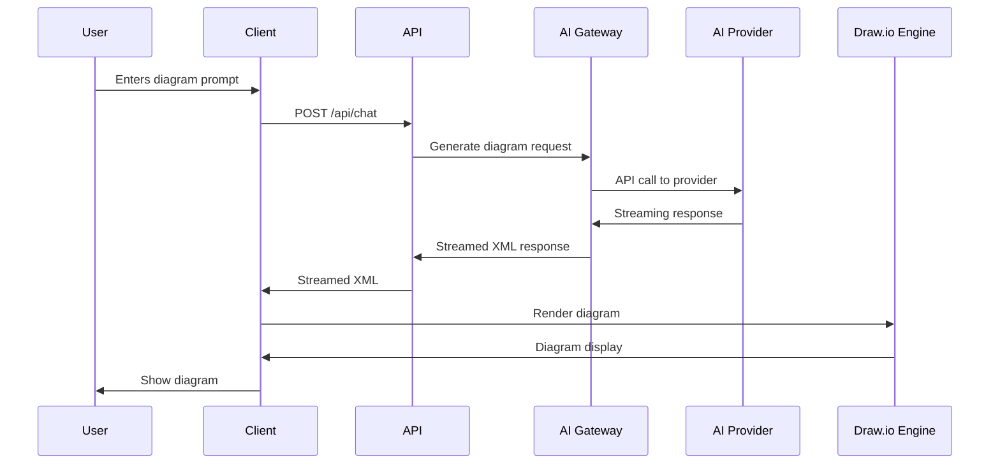
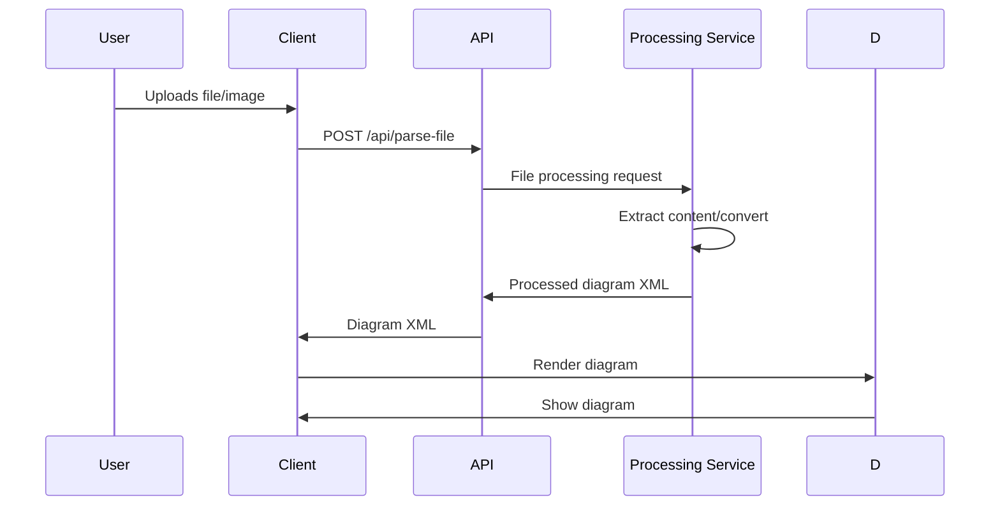
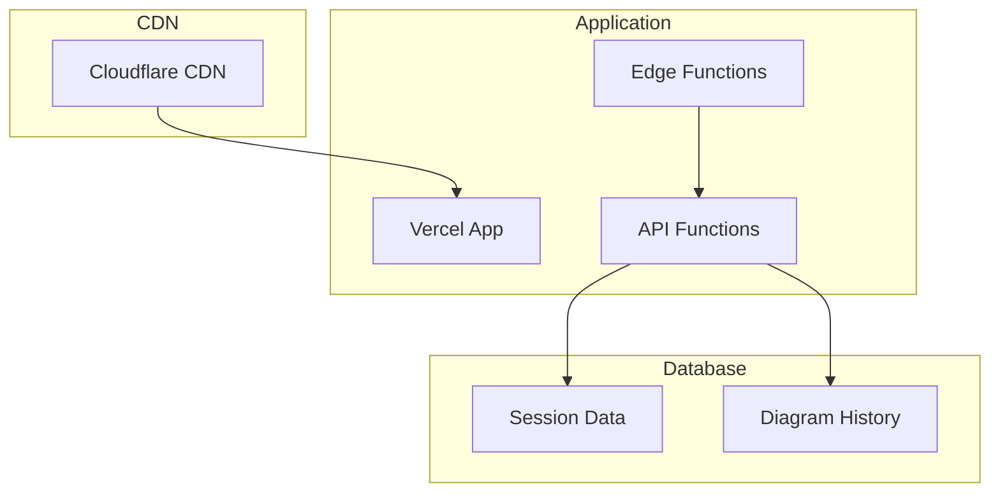
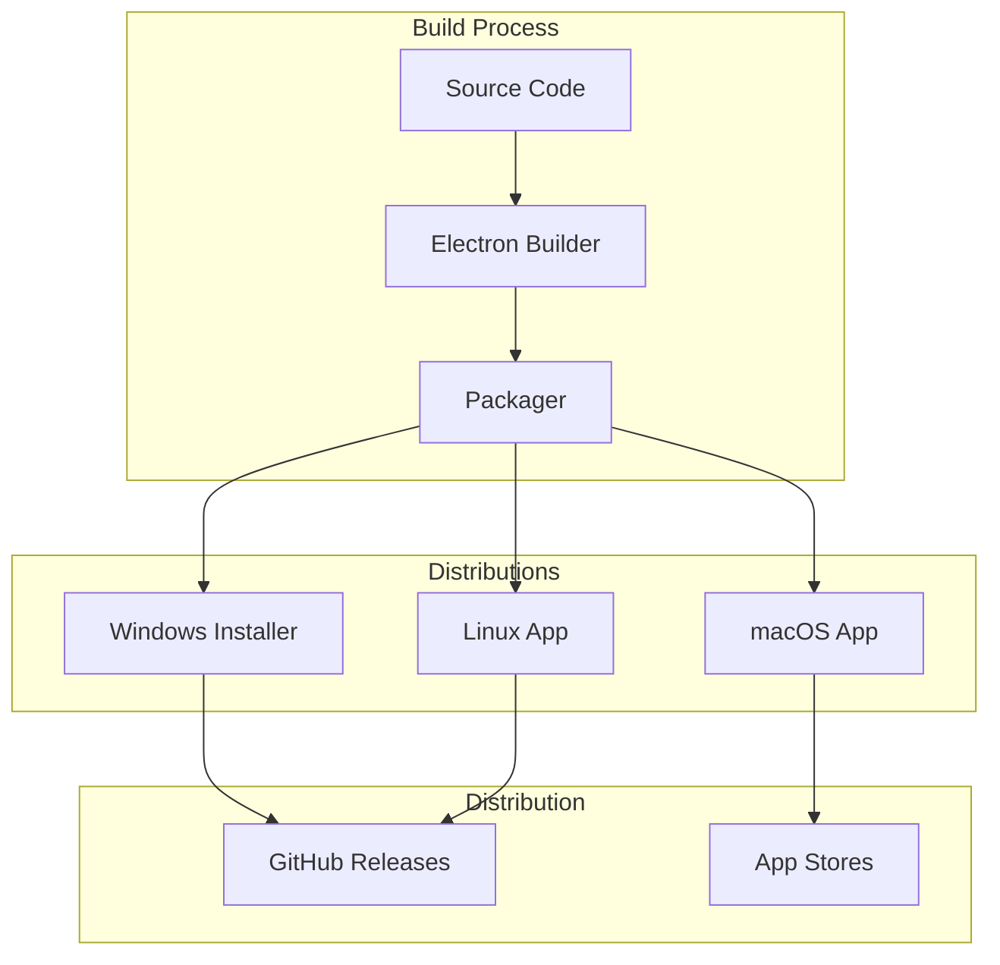
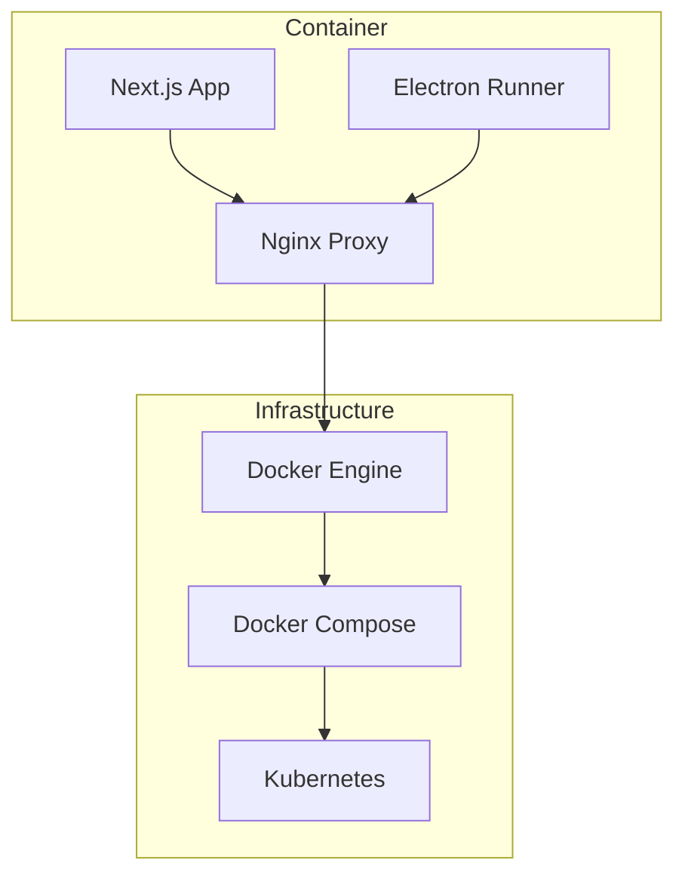

interface ModelConfig {
  id: string;
  name: string;
  provider: string;
  capabilities: ModelCapabilities;
  parameters: ModelParameters;
}

const MODEL_CONFIGS: Record<string, ModelConfig> = {
  'gpt-4': {
    id: 'gpt-4',
    name: 'GPT-4',
    provider: 'openai',
    capabilities: {
      xmlGeneration: true,
      reasoning: true,
      longContext: true
    },
    parameters: {
      maxTokens: 4000,
      temperature: 0.7
    }
  },
  'claude-3-sonnet': {
    id: 'claude-3-sonnet',
    name: 'Claude 3 Sonnet',
    provider: 'anthropic',
    capabilities: {
      xmlGeneration: true,
      reasoning: true,
      diagramOptimization: true
    },
    parameters: {
      maxTokens: 4000,
      temperature: 0.3
    }
  }
};
```

---

## Data Flow

### Diagram Generation Flow


### File Processing Flow


---

## Deployment Architecture

### Web Deployment (Vercel/Cloudflare)


### Desktop Application Deployment


### Docker Deployment


---

## Security Architecture

### Data Protection
```typescript
class SecurityManager {
  // API key encryption
  encryptApiKey(apiKey: string): string {
    const encrypted = crypto.subtle.encrypt(
      { name: 'AES-GCM' },
      this.getEncryptionKey(),
      new TextEncoder().encode(apiKey)
    );
    return encrypted;
  }

  // Request validation
  validateRequest(request: Request): boolean {
    // Validate CORS headers
    // Validate CSRF tokens
    // Validate rate limits
    return true;
  }

  // Content sanitization
  sanitizeXML(xml: string): string {
    // Remove potentially malicious content
    return xml
      .replace(/javascript:/gi, '')
      .replace(/on\w+\s*=/gi, '');
  }
}
```

### Authentication & Authorization
```typescript
interface AuthConfig {
  provider: string;
  apiKey: string;
  permissions: Permission[];
}

enum Permission {
  READ = 'read',
  WRITE = 'write',
  ADMIN = 'admin'
}

class AuthService {
  async validateUser(apiKey: string): Promise<User | null> {
    // Validate API key
    // Check permissions
    // Return user object
  }

  hasPermission(user: User, permission: Permission): boolean {
    return user.permissions.includes(permission);
  }
}
```

### Privacy Protection
```typescript
class PrivacyManager {
  // Data anonymization
  anonymizeUserData(data: UserInput): AnonymizedData {
    // Remove personally identifiable information
    // Strip metadata
    // Apply hashing
  }

  // GDPR compliance
  deleteUserData(userId: string): Promise<void> {
    // Remove all user data
    // Delete from storage
    // Notify compliance systems
  }

  // Data retention policies
  getRetentionPolicy(): RetentionPolicy {
    return {
      default: 30,
      sensitive: 7,
      archived: 365
    };
  }
}
```

---

## Scalability Considerations

### Horizontal Scaling
```typescript
// Load balancing configuration
const loadBalancer = {
  strategy: 'round-robin',
  servers: [
    { url: 'api1.example.com', weight: 1 },
    { url: 'api2.example.com', weight: 1 },
    { url: 'api3.example.com', weight: 2 }
  ]
};

// Database sharding
const databaseConfig = {
  sharding: {
    strategy: 'hash-based',
    shards: 4,
    key: 'userId'
  }
};
```

### Caching Strategy
```typescript
class CacheManager {
  private cache: Map<string, CacheEntry> = new Map();

  // TTL-based caching
  set(key: string, value: any, ttl: number): void {
    const expiry = Date.now() + ttl;
    this.cache.set(key, { value, expiry });

    // Auto-expire
    setTimeout(() => {
      this.cache.delete(key);
    }, ttl);
  }

  // LRU caching
  get(key: string): any | null {
    const entry = this.cache.get(key);
    if (!entry || entry.expiry < Date.now()) {
      return null;
    }
    return entry.value;
  }
}
```

### Performance Monitoring
```typescript
class PerformanceMonitor {
  // Metrics collection
  trackMetric(name: string, value: number): void {
    // Send to monitoring service
    console.log(`Metric ${name}: ${value}`);
  }

  // Performance analysis
  analyzePerformance(): PerformanceReport {
    // Analyze metrics
    // Identify bottlenecks
    // Generate recommendations
  }
}
```

---

## Monitoring & Observability

### Logging Infrastructure
```typescript
interface LogConfig {
  level: 'debug' | 'info' | 'warn' | 'error';
  format: 'json' | 'text';
  outputs: ('console' | 'file' | 'remote')[];
}

class Logger {
  private config: LogConfig;

  debug(message: string, data?: any): void {
    this.log('debug', message, data);
  }

  info(message: string, data?: any): void {
    this.log('info', message, data);
  }

  error(message: string, error?: Error): void {
    this.log('error', message, { error });
  }

  private log(level: string, message: string, data?: any): void {
    // Log to configured outputs
  }
}
```

### Error Tracking
```typescript
class ErrorTracker {
  // Error reporting
  reportError(error: Error, context?: any): void {
    // Send to error tracking service
    console.error('Error reported:', error, context);
  }

  // Error aggregation
  getErrorMetrics(): ErrorMetrics {
    // Analyze error patterns
    // Generate metrics
  }
}
```

---

## Future Architecture Considerations

### Microservices Migration
```mermaid
graph TB
    subgraph "Current Monolith"
        App[Next.js App]
        API[API Routes]
        DB[Database]
    end

    subgraph "Future Microservices"
        AIService[AI Service]
        UserService[User Service]
        DiagramService[Diagram Service]
        NotificationService[Notification Service]
    end

    App --> API
    API --> DB

    Future: App --> AIService
    Future: App --> UserService
    Future: App --> DiagramService
    Future: AIService --> DB
    Future: UserService --> DB
    Future: DiagramService --> DB
```

### Edge Computing Integration
```typescript
interface EdgeConfig {
  providers: string[];
  regions: string[];
  caching: CacheConfig;
}

class EdgeService {
  async processAtEdge(prompt: string): Promise<DiagramResponse> {
    // Process request at edge location
    // Reduce latency
    // Improve performance
  }
}
```

---

This architecture documentation provides a comprehensive view of how AIO Canvas is structured and how it integrates with draw.io while adding AI capabilities. The architecture supports both web and desktop deployment with a focus on performance, security, and scalability.