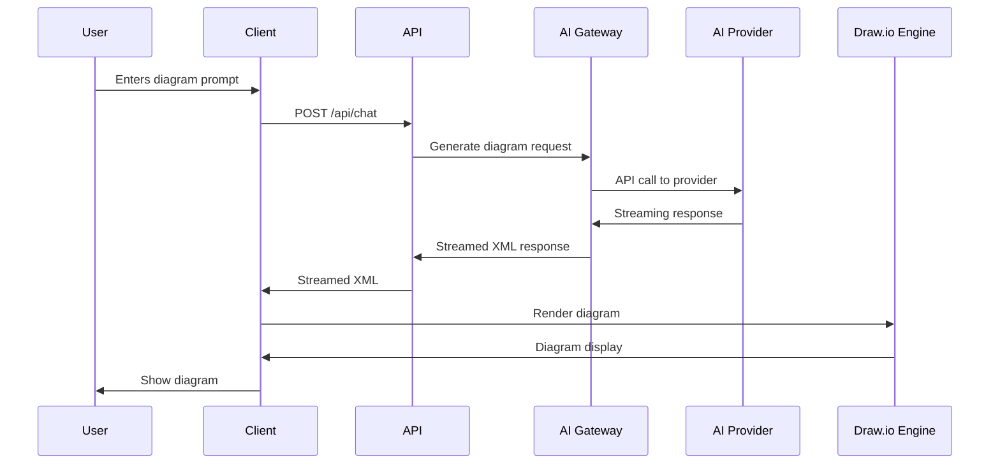
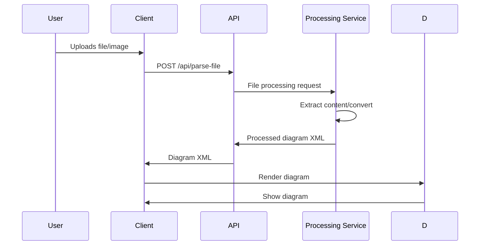
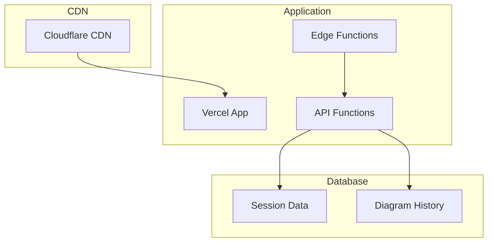
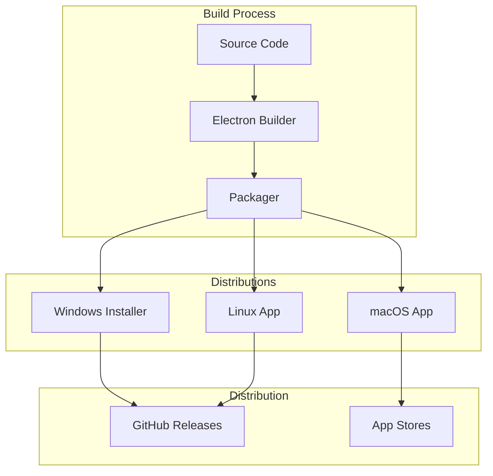
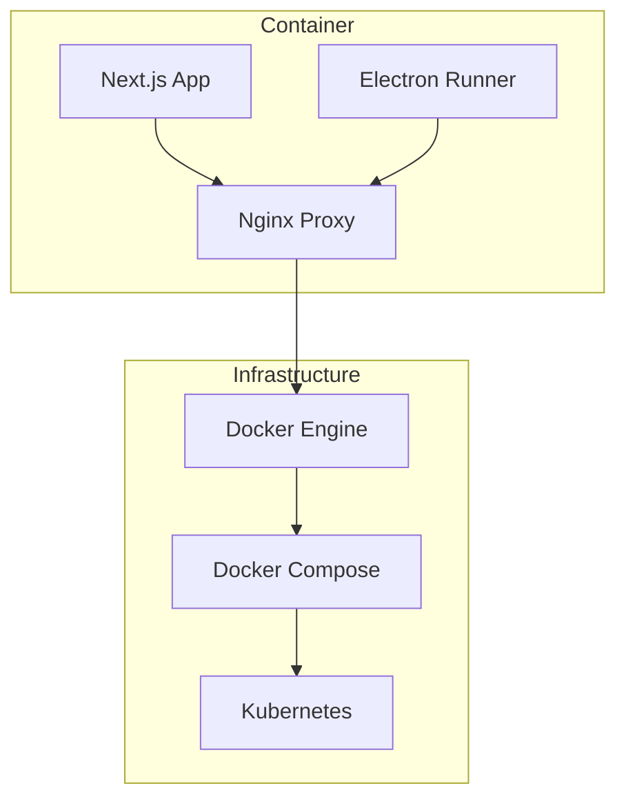
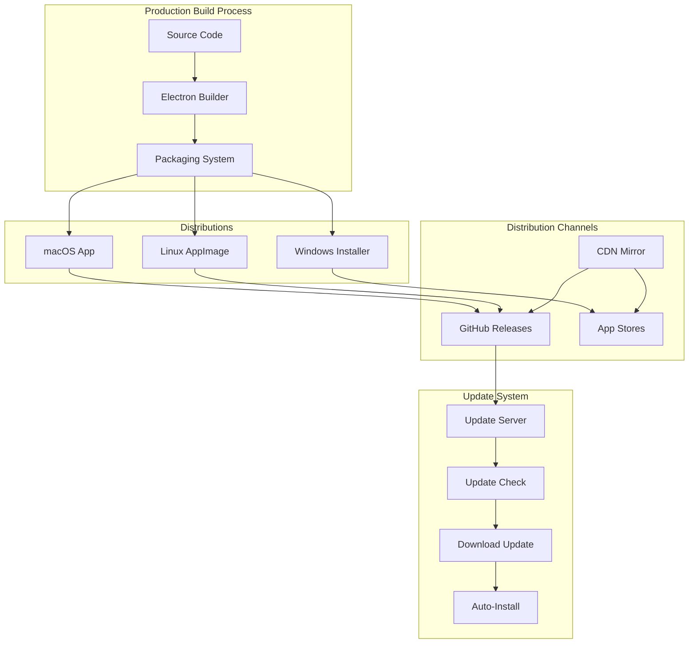

interface ModelConfig {
  id: string;
  name: string;
  provider: string;
  capabilities: ModelCapabilities;
  parameters: ModelParameters;

const MODEL_CONFIGS: Record<string, ModelConfig> = {
  'gpt-4': {
    id: 'gpt-4',
    name: 'GPT-4',
    provider: 'openai',
    capabilities: {
      xmlGeneration: true,
      reasoning: true,
      longContext: true
    },
    parameters: {
      maxTokens: 4000,
      temperature: 0.7
    }
  },
  'claude-3-sonnet': {
    id: 'claude-3-sonnet',
    name: 'Claude 3 Sonnet',
    provider: 'anthropic',
    capabilities: {
      xmlGeneration: true,
      reasoning: true,
      diagramOptimization: true
    },
    parameters: {
      maxTokens: 4000,
      temperature: 0.3
    }
  }
};
```

---

## Data Flow

### Diagram Generation Flow


### File Processing Flow


---

## Deployment Architecture

### Web Deployment (Vercel/Cloudflare)


### Desktop Application Deployment


### Docker Deployment


---

## Security Architecture

### Data Protection
```typescript
class SecurityManager {
  // API key encryption
  encryptApiKey(apiKey: string): string {
    const encrypted = crypto.subtle.encrypt(
      { name: 'AES-GCM' },
      this.getEncryptionKey(),
      new TextEncoder().encode(apiKey)
    );
    return encrypted;
  }

  // Request validation
  validateRequest(request: Request): boolean {
    // Validate CORS headers
    // Validate CSRF tokens
    // Validate rate limits
    return true;
  }

  // Content sanitization
  sanitizeXML(xml: string): string {
    // Remove potentially malicious content
    return xml
      .replace(/javascript:/gi, '')
      .replace(/on\w+\s*=/gi, '');
  }
}
```

### Authentication & Authorization
```typescript
interface AuthConfig {
  provider: string;
  apiKey: string;
  permissions: Permission[];
}

enum Permission {
  READ = 'read',
  WRITE = 'write',
  ADMIN = 'admin'
}

class AuthService {
  async validateUser(apiKey: string): Promise<User | null> {
    // Validate API key
    // Check permissions
    // Return user object
  }

  hasPermission(user: User, permission: Permission): boolean {
    return user.permissions.includes(permission);
  }
}
```

### Privacy Protection
```typescript
class PrivacyManager {
  // Data anonymization
  anonymizeUserData(data: UserInput): AnonymizedData {
    // Remove personally identifiable information
    // Strip metadata
    // Apply hashing
  }

  // GDPR compliance
  deleteUserData(userId: string): Promise<void> {
    // Remove all user data
    // Delete from storage
    // Notify compliance systems
  }

  // Data retention policies
  getRetentionPolicy(): RetentionPolicy {
    return {
      default: 30,
      sensitive: 7,
      archived: 365
    };
  }
}
```

---

## Scalability Considerations

### Horizontal Scaling
```typescript
// Load balancing configuration
const loadBalancer = {
  strategy: 'round-robin',
  servers: [
    { url: 'api1.example.com', weight: 1 },
    { url: 'api2.example.com', weight: 1 },
    { url: 'api3.example.com', weight: 2 }
  ]
};

// Database sharding
const databaseConfig = {
  sharding: {
    strategy: 'hash-based',
    shards: 4,
    key: 'userId'
  }
};
```

### Caching Strategy
```typescript
class CacheManager {
  private cache: Map<string, CacheEntry> = new Map();

  // TTL-based caching
  set(key: string, value: any, ttl: number): void {
    const expiry = Date.now() + ttl;
    this.cache.set(key, { value, expiry });

    // Auto-expire
    setTimeout(() => {
      this.cache.delete(key);
    }, ttl);
  }

  // LRU caching
  get(key: string): any | null {
    const entry = this.cache.get(key);
    if (!entry || entry.expiry < Date.now()) {
      return null;
    }
    return entry.value;
  }
}
```

### Performance Monitoring
```typescript
class PerformanceMonitor {
  // Metrics collection
  trackMetric(name: string, value: number): void {
    // Send to monitoring service
    console.log(`Metric ${name}: ${value}`);
  }

  // Performance analysis
  analyzePerformance(): PerformanceReport {
    // Analyze metrics
    // Identify bottlenecks
    // Generate recommendations
  }
}
```

---

## Monitoring & Observability

### Logging Infrastructure
```typescript
interface LogConfig {
  level: 'debug' | 'info' | 'warn' | 'error';
  format: 'json' | 'text';
  outputs: ('console' | 'file' | 'remote')[];
}

class Logger {
  private config: LogConfig;

  debug(message: string, data?: any): void {
    this.log('debug', message, data);
  }

  info(message: string, data?: any): void {
    this.log('info', message, data);
  }

  error(message: string, error?: Error): void {
    this.log('error', message, { error });
  }

  private log(level: string, message: string, data?: any): void {
    // Log to configured outputs
  }
}
```

### Error Tracking
```typescript
class ErrorTracker {
  // Error reporting
  reportError(error: Error, context?: any): void {
    // Send to error tracking service
    console.error('Error reported:', error, context);
  }

  // Error aggregation
  getErrorMetrics(): ErrorMetrics {
    // Analyze error patterns
    // Generate metrics
  }
}
```

---

## Future Architecture Considerations

### Microservices Migration
```mermaid
graph TB
    subgraph "Current Monolith"
        App[Next.js App]
        API[API Routes]
        DB[Database]
    end

    subgraph "Future Microservices"
        AIService[AI Service]
        UserService[User Service]
        DiagramService[Diagram Service]
        NotificationService[Notification Service]
    end

    App --> API
    API --> DB

    Future: App --> AIService
    Future: App --> UserService
    Future: App --> DiagramService
    Future: AIService --> DB
    Future: UserService --> DB
    Future: DiagramService --> DB
```

### Edge Computing Integration
```typescript
interface EdgeConfig {
  providers: string[];
  regions: string[];
  caching: CacheConfig;
}

class EdgeService {
  async processAtEdge(prompt: string): Promise<DiagramResponse> {
    // Process request at edge location
    // Reduce latency
    // Improve performance
  }
}
```

---

---

## Desktop Application Deployment Architecture

### Production Build Process

#### Build Configuration
```typescript
// electron-builder.config.json
{
  "appId": "com.canvas-ai-o.app",
  "productName": "AIO Canvas",
  "directories": {
    "output": "dist"
  },
  "files": [
    "**/*",
    "!**/node_modules/*/{test,__tests__,tests,pkg,test.js,spec.js,*.test.*}",
    "!**/node_modules/.bin",
    "!**/*.{iml,o,hprof,orig,pyc,pyo,rbc,swp,csproj,sln,xproj}"
  ],
  "mac": {
    "category": "public.app-category.productivity",
    "target": ["dmg"],
    "hardenedRuntime": true,
    "entitlements": "entitlements.mac.plist",
    "entitlementsInherit": "entitlements.mac.plist"
  },
  "win": {
    "target": ["nsis"],
    "signingHashAlgorithms": ["sha256"],
    "certificateFile": "certificate.p12",
    "certificatePassword": "${WIN_CREDENTIAL_PASSWORD}"
  },
  "linux": {
    "target": ["AppImage"],
    "category": "Development"
  }
}
```

#### Electron Main Process Architecture
```typescript
// electron/main.ts
import { app, BrowserWindow, ipcMain, dialog } from 'electron';
import path from 'path';
import { DatabaseManager } from './services/database';
import { SecureStorage } from './services/secure-storage';

class ElectronApp {
  private mainWindow: BrowserWindow | null = null;
  private db: DatabaseManager;
  private secureStorage: SecureStorage;

  constructor() {
    this.db = new DatabaseManager();
    this.secureStorage = new SecureStorage();
    this.setupApp();
    this.setupIPC();
  }

  private setupApp(): void {
    // Handle app lifecycle
    app.whenReady().then(() => this.createWindow());

    app.on('window-all-closed', () => {
      if (process.platform !== 'darwin') {
        app.quit();
      }
    });

    app.on('activate', () => {
      if (BrowserWindow.getAllWindows().length === 0) {
        this.createWindow();
      }
    });
  }

  private async createWindow(): Promise<void> {
    const mainWindow = new BrowserWindow({
      width: 1200,
      height: 800,
      webPreferences: {
        nodeIntegration: false,
        contextIsolation: true,
        preload: path.join(__dirname, 'preload.js'),
        webSecurity: process.env.NODE_ENV === 'production'
      },
      titleBarStyle: 'hiddenInset'
    });

    // Load React app
    await mainWindow.loadFile(path.join(__dirname, '../build/index.html'));

    // Development tools
    if (process.env.NODE_ENV === 'development') {
      mainWindow.webContents.openDevTools();
    }

    this.mainWindow = mainWindow;
  }

  private setupIPC(): void {
    // File operations
    ipcMain.handle('dialog:openFile', async () => {
      const result = await dialog.showOpenDialog({
        properties: ['openFile'],
        filters: [
          { name: 'Diagram Files', extensions: ['xml', 'drawio', 'vsdx'] },
          { name: 'All Files', extensions: ['*'] }
        ]
      });
      return result.filePaths[0];
    });

    // Database operations
    ipcMain.handle('database:saveDiagram', async (event, data) => {
      return await this.db.saveDiagram(data);
    });

    ipcMain.handle('database:loadDiagram', async (event, id) => {
      return await this.db.loadDiagram(id);
    });

    // Secure storage
    ipcMain.handle('secure:saveApiKey', async (event, provider, key) => {
      const encryptedKey = this.secureStorage.encryptApiKey(key);
      return await this.db.saveConfig(`api_key_${provider}`, encryptedKey, true);
    });

    ipcMain.handle('secure:getApiKey', async (event, provider) => {
      const encryptedKey = await this.db.getConfig(`api_key_${provider}`);
      if (!encryptedKey) return null;
      return this.secureStorage.decryptApiKey(encryptedKey);
    });
  }
}
```

### Auto-Update Mechanism

#### Update Server Configuration
```typescript
// app/api/updates/route.ts
import { NextRequest, NextResponse } from 'next/server';

interface UpdateInfo {
  version: string;
  url: string;
  notes: string;
  pub_date: string;
}

export async function GET(request: NextRequest) {
  const updates: UpdateInfo[] = [
    {
      version: app.getVersion(),
      url: 'https://github.com/PhenixStar/canvas-A-I-O/releases',
      notes: 'Bug fixes and improvements\n- Enhanced auto-save functionality\n- Improved history management\n- Better error handling',
      pub_date: new Date().toISOString()
    }
  ];

  return NextResponse.json(updates);
}
```

#### Auto-Updater Integration
```typescript
// electron/services/updater.ts
import { autoUpdater } from 'electron-updater';
import { BrowserWindow } from 'electron';

export class UpdateService {
  constructor(private mainWindow: BrowserWindow) {
    this.setupUpdater();
  }

  private setupUpdater(): void {
    autoUpdater.setFeedURL({
      provider: 'generic',
      url: 'https://draw.nulled.ai/updates',
      channel: 'latest'
    });

    autoUpdater.on('checking-for-update', () => {
      this.mainWindow.webContents.send('update-status', { status: 'checking' });
    });

    autoUpdater.on('update-available', (info) => {
      this.mainWindow.webContents.send('update-status', {
        status: 'available',
        version: info.version
      });
    });

    autoUpdater.on('update-not-available', () => {
      this.mainWindow.webContents.send('update-status', { status: 'not-available' });
    });

    autoUpdater.on('download-progress', (progress) => {
      this.mainWindow.webContents.send('update-progress', progress);
    });

    autoUpdater.on('update-downloaded', () => {
      this.mainWindow.webContents.send('update-status', { status: 'downloaded' });
    });

    autoUpdater.on('error', (error) => {
      this.mainWindow.webContents.send('update-error', error);
    });
  }

  checkForUpdates(): void {
    autoUpdater.checkForUpdates();
  }

  installUpdate(): void {
    autoUpdater.quitAndInstall();
  }
}
```

### Offline Mode Architecture

#### Offline Resource Management
```typescript
// electron/services/offline-manager.ts
import { app, ipcMain } from 'electron';
import path from 'path';
import fs from 'fs/promises';

export class OfflineManager {
  private offlineDir: string;

  constructor() {
    this.offlineDir = path.join(app.getPath('userData'), 'offline');
    this.setupOfflineResources();
  }

  private async setupOfflineResources(): Promise<void> {
    // Create offline directory
    await fs.mkdir(this.offlineDir, { recursive: true });

    // Copy essential draw.io files
    const drawioDir = path.join(__dirname, 'node_modules', 'drawio', 'src', 'main');
    await this.copyDir(drawioDir, path.join(this.offlineDir, 'drawio'));
  }

  private async copyDir(src: string, dest: string): Promise<void> {
    await fs.mkdir(dest, { recursive: true });
    const entries = await fs.readdir(src, { withFileTypes: true });

    for (const entry of entries) {
      const srcPath = path.join(src, entry.name);
      const destPath = path.join(dest, entry.name);

      if (entry.isDirectory()) {
        await this.copyDir(srcPath, destPath);
      } else {
        await fs.copyFile(srcPath, destPath);
      }
    }
  }

  async getDrawioResource(resource: string): Promise<string> {
    const resourcePath = path.join(this.offlineDir, 'drawio', resource);
    return await fs.readFile(resourcePath, 'utf-8');
  }
}
```

#### Cache Management
```typescript
// electron/services/cache-manager.ts
import { app, ipcMain } from 'electron';
import path from 'path';
import fs from 'fs/promises';

interface CacheItem {
  key: string;
  data: string;
  timestamp: number;
  ttl: number;
}

export class CacheManager {
  private cacheDir: string;
  private memoryCache: Map<string, CacheItem> = new Map();

  constructor() {
    this.cacheDir = path.join(app.getPath('userData'), 'cache');
    this.setupCache();
  }

  private async setupCache(): Promise<void> {
    await fs.mkdir(this.cacheDir, { recursive: true });
  }

  async set(key: string, data: string, ttl: number = 3600000): Promise<void> {
    const cacheItem: CacheItem = {
      key,
      data,
      timestamp: Date.now(),
      ttl
    };

    // Store in memory cache
    this.memoryCache.set(key, cacheItem);

    // Store in file cache
    const cacheFile = path.join(this.cacheDir, `${key}.cache`);
    await fs.writeFile(cacheFile, JSON.stringify(cacheItem));
  }

  async get(key: string): Promise<string | null> {
    // Check memory cache first
    const memoryItem = this.memoryCache.get(key);
    if (memoryItem && !this.isExpired(memoryItem)) {
      return memoryItem.data;
    }

    // Check file cache
    const cacheFile = path.join(this.cacheDir, `${key}.cache`);
    try {
      const data = await fs.readFile(cacheFile, 'utf-8');
      const cacheItem: CacheItem = JSON.parse(data);

      if (this.isExpired(cacheItem)) {
        await this.delete(key);
        return null;
      }

      // Update memory cache
      this.memoryCache.set(key, cacheItem);
      return cacheItem.data;
    } catch {
      return null;
    }
  }

  private isExpired(item: CacheItem): boolean {
    return Date.now() - item.timestamp > item.ttl;
  }

  async delete(key: string): Promise<void> {
    this.memoryCache.delete(key);
    const cacheFile = path.join(this.cacheDir, `${key}.cache`);
    try {
      await fs.unlink(cacheFile);
    } catch {
      // File doesn't exist, ignore
    }
  }

  async clear(): Promise<void> {
    this.memoryCache.clear();
    const files = await fs.readdir(this.cacheDir);
    await Promise.all(files.map(file => fs.unlink(path.join(this.cacheDir, file))));
  }
}
```

### Packaging and Distribution

#### Package.json Configuration
```json
{
  "name": "canvas-A-I-O-desktop",
  "version": "1.0.0",
  "description": "AI-Powered Diagram Creation Tool",
  "main": "dist/main.js",
  "homepage": "https://draw.nulled.ai",
  "repository": {
    "type": "git",
    "url": "https://github.com/PhenixStar/canvas-A-I-O.git"
  },
  "build": {
    "appId": "com.canvas-ai-o.app",
    "productName": "AIO Canvas",
    "directories": {
      "output": "dist"
    },
    "files": [
      "dist/**/*",
      "!dist/**/*.map",
      "!dist/**/*.test.*"
    ],
    "mac": {
      "category": "public.app-category.productivity",
      "target": [
        {
          "target": "dmg",
          "arch": ["x64", "arm64"]
        }
      ],
      "hardenedRuntime": true,
      "entitlements": "entitlements.mac.plist",
      "entitlementsInherit": "entitlements.mac.plist"
    },
    "win": {
      "target": [
        {
          "target": "nsis",
          "arch": ["x64"]
        }
      ],
      "certificateFile": "certificate.p12",
      "certificatePassword": "${WIN_CREDENTIAL_PASSWORD}"
    },
    "linux": {
      "target": [
        {
          "target": "AppImage",
          "arch": ["x64"]
        }
      ]
    }
  },
  "publish": {
    "provider": "github",
    "owner": "PhenixStar",
    "repo": "canvas-A-I-O"
  }
}
```

#### Entitlements Configuration
```xml
<!-- entitlements.mac.plist -->
<?xml version="1.0" encoding="UTF-8"?>
<!DOCTYPE plist PUBLIC "-//Apple//DTD PLIST 1.0//EN" "http://www.apple.com/DTDs/PropertyList-1.0.dtd">
<plist version="1.0">
<dict>
    <key>com.apple.security.cs.allow-jit</key>
    <true/>
    <key>com.apple.security.cs.allow-unsigned-executable-memory</key>
    <true/>
    <key>com.apple.security.cs.allow-dyld-environment-variables</key>
    <true/>
    <key>com.apple.security.files.downloads.read-write</key>
    <true/>
    <key>com.apple.security.files.user-selected.read-write</key>
    <true/>
    <key>com.apple.security.network.client</key>
    <true/>
</dict>
</plist>
```

#### ASAR Packaging Strategy (v1.0.1+)

**Problem Solved: Module Resolution Conflicts**

In v1.0.0, the Windows desktop app failed to launch with error:
```
Error: Cannot find module 'zod'
```

**Root Cause:**
- Electron code bundled with zod in `dist-electron/main/persistence-handlers.js`
- Next.js standalone copied to `electron-standalone/` with its own `node_modules/zod`
- electron-builder packaged both, creating conflicting module resolution paths
- Node.js resolved to standalone's node_modules instead of bundled version
- Standalone's zod wasn't properly initialized, causing the error

**Solution: ASAR + node_modules Removal**

```yaml
# electron/electron-builder.yml
asar: true                    # Enable ASAR packaging
compression: maximum          # Reduce installer size

asarUnpack:
  - "**/*.node"              # Unpack native modules (better-sqlite3)

files:
  - dist-electron/**/*       # Only bundled Electron code
  - "!node_modules"

extraResources:
  - from: electron-standalone/  # Next.js app WITHOUT node_modules
    to: standalone/
```

**Build Process:**
```javascript
// scripts/prepare-electron-build.mjs
// After copying .next/standalone to electron-standalone
const standaloneNodeModules = join(targetDir, "node_modules")
if (existsSync(standaloneNodeModules)) {
    console.log("Removing node_modules from standalone...")
    rmSync(standaloneNodeModules, { recursive: true, force: true })
}

// Also remove cache directories
const cacheDirs = [
    join(targetDir, ".next", "cache"),
    join(targetDir, ".next", "server"),
]
cacheDirs.forEach(dir => {
    if (existsSync(dir)) rmSync(dir, { recursive: true, force: true })
})
```

**Architecture:**
```
release/win-unpacked/
├── resources/
│   ├── app.asar                    # Electron main process (ASAR archive)
│   │   ├── dist-electron/           # Our bundled code
│   │   │   └── main/
│   │   │       ├── persistence-handlers.js  # Contains bundled zod
│   │   │       ├── storage-manager.js
│   │   │       └── ... (all main process code)
│   │   └── node_modules/            # Bundled dependencies (virtual FS)
│   │       └── better-sqlite3/      # Unpacked to app.asar.unpacked/
│   └── standalone/                  # Next.js renderer process
│       └── canvas-A-I-O/
│           ├── .next/                # Next.js build output
│           ├── server.js             # Entry point
│           └── public/               # Static assets
│           # NO node_modules/        ← Removed to prevent conflicts
```

**Module Resolution:**
1. Electron main process loads from app.asar (virtual filesystem)
2. Node.js module resolution searches within app.asar first
3. Bundled dependencies in app.asar are found and used
4. No conflict with standalone (which has no node_modules)
5. Native modules unpacked via `asarUnpack` work normally

**Size Optimization:**
- Before: 624MB (with duplicate node_modules)
- After: ~274MB (without node_modules + compression)
- Reduction: 56% (350MB saved)

**Benefits:**
- ✅ Eliminates module resolution conflicts
- ✅ Smaller installer size
- ✅ Faster download/install
- ✅ Code protection (ASAR is harder to modify)
- ✅ Matches industry standard (draw.io desktop uses ASAR)

**Trade-offs:**
- ⚠️ Slightly more complex build process
- ⚠️ Native modules require special handling (asarUnpack)
- ⚠️ Debugging requires extracting from ASAR or using --asar=false

**Verification:**
```bash
# Check that ASAR is created
ls -lh release/win-unpacked/resources/app.asar

# Verify no node_modules in standalone
ls release/win-unpacked/resources/standalone/canvas-A-I-O/node_modules
# Should error: No such file or directory

# Verify native module is unpacked
ls release/win-unpacked/resources/app.asar.unpacked/node_modules/better-sqlite3
# Should show the unpacked native module
```

### Deployment Architecture Diagram



This architecture documentation provides a comprehensive view of how AIO Canvas is structured and how it integrates with draw.io while adding AI capabilities. The architecture supports both web and desktop deployment with a focus on performance, security, and scalability.