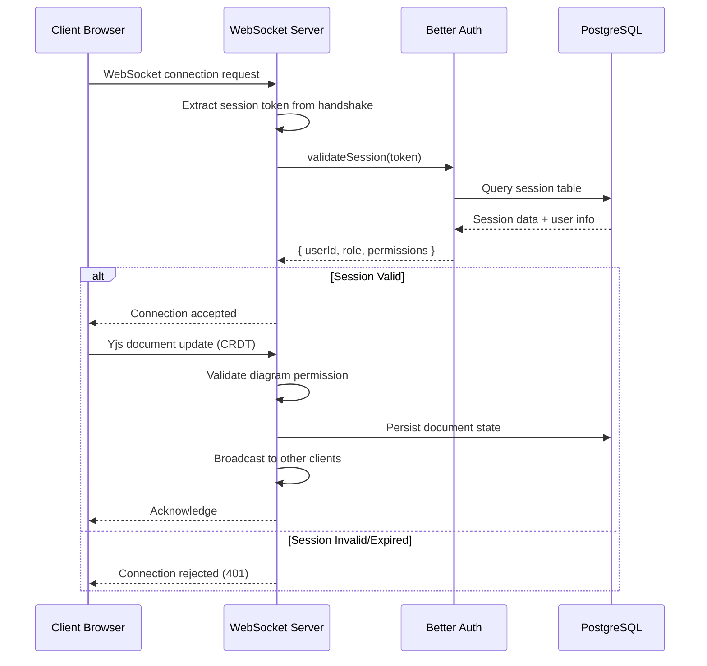

# Phase 2: WebSocket Server Implementation Plan

**Created:** 2026-02-09
**Status:** Planning
**Priority:** CRITICAL
**Target Completion:** Week 7 of Sprint 3

---

## Overview

Phase 2 implements the production-ready WebSocket server for real-time collaboration in Canvas AIO. This server handles CRDT document synchronization, user authentication via Better Auth, and persistent storage in PostgreSQL.

### Business Value

- **Real-time Collaboration**: Enables multiple users to edit diagrams simultaneously with <200ms sync
- **Scalability**: Supports 5+ concurrent users with room for horizontal scaling
- **Security**: Validates Better Auth sessions and enforces diagram-level permissions
- **Reliability**: PostgreSQL persistence ensures no data loss

### Success Metrics

- 5+ concurrent users editing same diagram
- <200ms sync latency (measured end-to-end)
- 99.9% uptime for WebSocket connections
- Zero data loss on server restart
- Proper session validation (no unauthorized access)

---

## Phase Files

| File | Purpose | Status |
|------|---------|--------|
| `phase-02-websocket-server.md` | Detailed implementation plan | 📝 In Progress |
| `phase-02-auth-middleware.md` | Better Auth integration spec | ⏳ Pending |
| `phase-02-database-adapter.md` | PostgreSQL persistence spec | ⏳ Pending |
| `phase-02-deployment.md` | PM2/Nginx deployment guide | ⏳ Pending |

---

## Key Decisions

### 1. Separate Node.js Server (Not Next.js API Routes)

**Why:**
- Next.js API routes are serverless (not suitable for persistent WebSocket connections)
- Separate server provides better control over connection lifecycle
- Independent scaling and deployment (can run on different port)
- Easier to debug and monitor WebSocket-specific issues

**Trade-offs:**
- Additional deployment complexity
- Need to manage separate process with PM2

### 2. Hocuspocus Server Framework

**Why:**
- Built-in Yjs integration (CRDT sync)
- Extension architecture for auth/persistence
- Production-ready with enterprise support
- Active community and documentation

**Trade-offs:**
- Learning curve for custom extensions
- Less flexibility than raw WebSocket implementation

### 3. PostgreSQL Persistence (Custom Adapter)

**Why:**
- Integrates with existing database schema
- Better Auth already uses PostgreSQL
- Transactional integrity for document updates
- No additional infrastructure (Redis)

**Trade-offs:**
- Need to implement custom DatabaseAdapter
- Slower than Redis for high-frequency writes

---

## Architecture Overview

```
┌──────────────────────────────────────────────────────────────┐
│                    Client Browser (draw.nulled.ai)           │
├──────────────────────────────────────────────────────────────┤
│  React UI │ Yjs CRDT │ y-websocket │ Better Auth Session    │
└────────────┴──────────┴─────────────┴────────────────────────┘
                          ↕ WebSocket (WSS://:3001)
┌──────────────────────────────────────────────────────────────┐
│              Hocuspocus WebSocket Server (Port 3001)          │
├──────────────────────────────────────────────────────────────┤
│  ┌───────────────┐  ┌──────────────┐  ┌──────────────┐     │
│  │  Auth Hook    │  │   Yjs Sync   │  │ Persistence  │     │
│  │  (Better Auth)│  │  (CRDT Merge)│  │ (PostgreSQL) │     │
│  └───────────────┘  └──────────────┘  └──────────────┘     │
└──────────────────────────────────────────────────────────────┘
                          ↕
┌──────────────────────────────────────────────────────────────┐
│                    PostgreSQL Database                       │
├──────────────────────────────────────────────────────────────┤
│  user │ session │ diagram │ yjs_document │ yjs_state        │
└──────────────────────────────────────────────────────────────┘
```

### Data Flow: Authentication & Sync



---

## Implementation Phases

### Phase 2.1: Core Server Setup (Days 1-2)
- [ ] Install Hocuspocus dependencies
- [ ] Create basic WebSocket server
- [ ] Configure port and logging
- [ ] Test with simple Yjs client

### Phase 2.2: Better Auth Integration (Days 3-4)
- [ ] Implement session validation hook
- [ ] Add user context to connections
- [ ] Test authentication flow
- [ ] Handle token expiration gracefully

### Phase 2.3: PostgreSQL Persistence (Days 5-6)
- [ ] Create DatabaseAdapter extension
- [ ] Design Yjs document storage schema
- [ ] Implement load/save hooks
- [ ] Test persistence and recovery

### Phase 2.4: Permission Validation (Days 7-8)
- [ ] Integrate RBAC permission checks
- [ ] Validate diagram access on connection
- [ ] Prevent unauthorized room joins
- [ ] Log security events

### Phase 2.5: Deployment & Monitoring (Days 9-10)
- [ ] Configure PM2 process management
- [ ] Setup Nginx reverse proxy
- [ ] Add health check endpoint
- [ ] Configure logging and monitoring
- [ ] Load testing (5+ concurrent users)

---

## Technical Stack

### Core Dependencies
```json
{
  "@hocuspocus/server": "^2.13.4",
  "@hocuspocus/transformer": "^2.0.0",
  "better-auth": "^1.4.18",
  "pg": "^8.18.0",
  "drizzle-orm": "^0.45.1"
}
```

### Development Dependencies
```json
{
  "@types/node": "^24.0.0",
  "@types/pg": "^8.16.0",
  "pm2": "^5.4.0"
}
```

---

## File Structure

```
server/
├── websocket-server.ts         # Main Hocuspocus server configuration
├── auth-middleware.ts          # Better Auth session validation
├── DatabaseAdapter.ts          # PostgreSQL persistence extension
├── logger.ts                   # Structured logging utility
└── health-check.ts             # Health check endpoint

config/
├── nginx-websocket.conf        # Nginx reverse proxy configuration
└── ecosystem.config.cjs        # PM2 process configuration

lib/db/
└── schema.ts                   # Add Yjs document tables

scripts/
├── setup-websocket-db.ts       # Database migration for Yjs tables
└── test-websocket.sh           # Manual test script
```

---

## Database Schema

### Yjs Document Storage

```sql
-- Yjs document state (CRDT binary data)
CREATE TABLE yjs_document (
  id TEXT PRIMARY KEY,              -- document name (room ID)
  data BYTEA NOT NULL,             -- Yjs document state (binary)
  updated_at TIMESTAMPTZ NOT NULL DEFAULT NOW()
);

-- Yjs update log (optional, for debugging/audit)
CREATE TABLE yjs_update_log (
  id BIGSERIAL PRIMARY KEY,
  document_id TEXT NOT NULL REFERENCES yjs_document(id) ON DELETE CASCADE,
  update BYTEA NOT NULL,            -- Individual CRDT update
  user_id TEXT REFERENCES "user"(id) ON DELETE SET NULL,
  created_at TIMESTAMPTZ NOT NULL DEFAULT NOW()
);

CREATE INDEX idx_yjs_document_updated ON yjs_document(updated_at);
CREATE INDEX idx_yjs_update_log_doc ON yjs_update_log(document_id, created_at DESC);
```

---

## Security Considerations

### 1. WebSocket Authentication
- **Token Validation**: Extract Better Auth session token from WebSocket handshake
- **Session Expiry**: Reject connections with expired sessions
- **User Context**: Attach user info to WebSocket connection for permission checks

### 2. Room Isolation
- **Room ID**: Use diagram ID as room identifier
- **Permission Check**: Validate `diagram:view` permission before allowing connection
- **Access Control**: Prevent users from joining rooms they don't have access to

### 3. Rate Limiting
- **Connection Limit**: Max 100 connections per user
- **Update Rate**: Max 100 updates/second per connection
- **Memory Limit**: Max 10MB per document

### 4. Data Validation
- **Input Sanitization**: Validate all incoming Yjs updates
- **Size Limits**: Reject documents >50MB
- **Malformed Data**: Gracefully handle invalid CRDT operations

---

## Testing Strategy

### Unit Tests
- [ ] Auth middleware token validation
- [ ] DatabaseAdapter load/save operations
- [ ] Permission checking logic
- [ ] Rate limiting enforcement

### Integration Tests
- [ ] Client connection with valid session
- [ ] Client rejection with invalid session
- [ ] Document persistence across server restart
- [ ] Permission-based room access

### Load Tests
- [ ] 5 concurrent users editing same diagram
- [ ] Measure sync latency (<200ms target)
- [ ] Memory usage under load
- [ ] Connection churn (connect/disconnect)

### Manual Tests
- [ ] Open 3 browser windows, edit same diagram
- [ ] Kill server process, verify recovery
- [ ] Test with expired session token
- [ ] Verify Nginx proxy passes WebSocket traffic

---

## Deployment Checklist

### Prerequisites
- [ ] PostgreSQL database accessible
- [ ] Better Auth sessions working (Sprint 2 complete)
- [ ] Node.js 22+ installed on VPS
- [ ] PM2 installed globally
- [ ] Nginx configured for reverse proxy

### VPS Setup
```bash
# Install dependencies
npm install pm2 -g
npm install @hocuspocus/server @hocuspocus/transformer

# Run database migration
npm run setup:websocket-db

# Start WebSocket server
pm2 start server/websocket-server.ts --name canvas-ws
pm2 save
pm2 startup
```

### Nginx Configuration
```nginx
# /etc/nginx/sites-available/canvas-websocket
map $http_upgrade $connection_upgrade {
    default upgrade;
    '' close;
}

upstream websocket_backend {
    server 127.0.0.1:3001;
}

server {
    listen 443 ssl http2;
    server_name draw.nulled.ai;

    location /ws {
        proxy_pass http://websocket_backend;
        proxy_http_version 1.1;
        proxy_set_header Upgrade $http_upgrade;
        proxy_set_header Connection $connection_upgrade;
        proxy_set_header Host $host;
        proxy_set_header X-Real-IP $remote_addr;
        proxy_set_header X-Forwarded-For $proxy_add_x_forwarded_for;
        proxy_read_timeout 86400;
    }
}
```

### Monitoring
```bash
# PM2 monitoring
pm2 monit

# View logs
pm2 logs canvas-ws

# Restart if crashed
pm2 resurrect
```

---

## Risks & Mitigations

| Risk | Impact | Probability | Mitigation |
|------|--------|-------------|------------|
| Better Auth session extraction fails | HIGH | MEDIUM | Test token extraction early; fallback to manual validation |
| Yjs binary data corruption | CRITICAL | LOW | Implement checksum validation; add backup/restore |
| WebSocket memory leak | HIGH | MEDIUM | Regular monitoring; implement document GC |
| Nginx proxy drops connections | HIGH | LOW | Test Nginx config; increase proxy timeouts |
| PostgreSQL write bottleneck | MEDIUM | LOW | Implement debouncing; batch writes |

---

## Success Criteria

### Functional Requirements
- [ ] WebSocket server accepts connections on port 3001
- [ ] Valid Better Auth sessions can connect
- [ ] Invalid/expired sessions are rejected
- [ ] Yjs document state persists to PostgreSQL
- [ ] Document state loads correctly on server restart
- [ ] Permission checks prevent unauthorized room access

### Non-Functional Requirements
- [ ] <200ms sync latency for 5 concurrent users
- [ ] Server handles 100+ concurrent connections
- [ ] Zero data loss on server restart
- [ ] Graceful handling of malformed CRDT updates
- [ ] PM2 keeps server running (auto-restart on crash)

### Integration Requirements
- [ ] Works with Phase 1 Yjs client
- [ ] Uses existing Better Auth session format
- [ ] Integrates with existing PostgreSQL schema
- [ ] Nginx reverse proxy configured correctly

---

## Next Steps

1. **Review Plan** (Day 0)
   - Validate technical approach with team
   - Confirm VPS access and credentials
   - Review Better Auth session format

2. **Phase 2.1 Setup** (Days 1-2)
   - Install dependencies
   - Create basic server
   - Test with mock Yjs client

3. **Phase 2.2 Auth Integration** (Days 3-4)
   - Implement Better Auth validation
   - Test with real session tokens
   - Handle edge cases (expired, invalid)

4. **Phase 2.3 Persistence** (Days 5-6)
   - Implement DatabaseAdapter
   - Test load/save cycles
   - Verify recovery after restart

5. **Phase 2.4 Permissions** (Days 7-8)
   - Integrate RBAC checks
   - Test room access control
   - Log security events

6. **Phase 2.5 Deployment** (Days 9-10)
   - Configure PM2
   - Setup Nginx proxy
   - Load testing
   - Production deployment

---

## Dependencies

### Completed (Required)
- ✅ Sprint 2: Better Auth + RBAC
- ✅ PostgreSQL database schema
- ✅ Phase 1: Yjs client integration

### In Progress (Blocking)
- ⏳ Yjs document schema design
- ⏳ Permission system refinement

### Required Before Deployment
- ⏳ Nginx SSL certificate (if not already)
- ⏳ VPS firewall rules (port 3001 access)
- ⏳ Database migration scripts

---

*Last updated: 2026-02-09*
